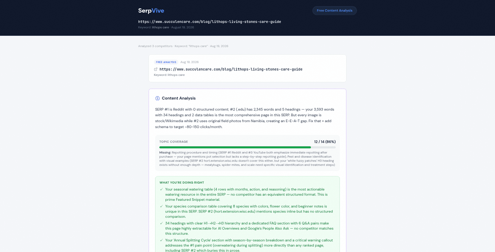

# SerpVive

SerpVive is a content decay monitor for blogs: it connects to Google Search Console, detects which pages are losing organic traffic using a deterministic scoring engine, and uses a multi-provider LLM pipeline — grounded in live search results (SERP, the page Google shows for a query) and the page's actual content — to diagnose *why* and generate an actionable refresh brief.

> ### How this was built, and what it is
>
> **Vibecoded with Claude Code** — 283 commits, 282 of them co-authored by a Claude model. Every commit was a pair session, so the git history cannot separate a human-typed line from a model-generated one, and I won't pretend otherwise.
>
> **What was mine:** the specification and architecture came before the code — the initial commit contains 11 documents, including the full SQL schema in [`docs/ARCHITECTURE.md`](docs/ARCHITECTURE.md). [`CLAUDE.md`](CLAUDE.md) is the operating manual the assistant worked under, published here in Portuguese exactly as it was used: it locks the stack ("never suggest alternatives unless asked"), forbids `any`, requires Zod on every boundary and RLS on every table, and bans the LLM from anything deterministic math can compute. 283 commits later the project still matches its day-one architecture doc. And the decisions that came out of things breaking in production: the four-provider fallback chain ordered by blast radius, the brief generator skipping the strongest model because it timed out, Firecrawl replacing Cheerio with Cheerio kept as fallback, the four-step ladder for malformed JSON, and the rule that no LLM touches anything deterministic math can compute.
>
> **What is not done:** no automated tests, no CI, no paying users, monetization switched off, alerting never delivered, and the quality of the AI diagnoses never systematically evaluated.
>
> **Status: paused since April 2026.** My current focus is OrmaOS, an observability monitor for asynchronous jobs, which I am writing without AI generating the code.
>
> The prompts are published on purpose. What would defend this product is the continuous pipeline and the historical data it accumulates per site — not the text of a prompt, which anyone can read and nobody can run without the rest.

**[See a live analysis →](https://serpvive.com/demo/7aJVgyy6)** — a real diagnosis of a real page, no login required ([two](https://serpvive.com/demo/_APmqmEn) [more](https://serpvive.com/demo/Ox3qQvr0)).



## The problem

Bloggers and SEO consultants find decaying content by exporting Search Console data into spreadsheets and eyeballing the deltas, page by page, month after month. The detection part of that work is pure arithmetic that software should do; the diagnosis part ("why did this page lose its ranking?") requires comparing the page against what currently ranks — which is exactly the kind of grounded, multi-source reasoning LLMs are good at. SerpVive splits the problem along that line.

## Architecture

```mermaid
flowchart LR
    subgraph Ingestion
        GSC[Google Search Console API<br/>OAuth 2.0, daily cron]
    end
    subgraph Engine["Scoring engine — deterministic, no AI"]
        SCORE[Decay score<br/>peak vs. current clicks]
        VEL[Velocity 7d/28d]
        SEAS[Seasonality check]
        CLASS[Status classifier<br/>healthy / warning / critical / dead]
    end
    subgraph Evidence["Evidence gathering"]
        SERP[Serper.dev<br/>top 10 SERP results]
        FETCH[Firecrawl → Cheerio fallback<br/>page + top 3 competitors]
        QUERIES[Top 20 GSC queries<br/>for the page]
    end
    subgraph AI["LLM pipeline"]
        CHAIN[4-provider fallback chain<br/>Opus 5 → Sonnet 5 → Gemini → GPT-5.6]
        VALIDATE[JSON repair → Zod validation<br/>→ 1 error-informed retry]
    end
    GSC --> Engine
    Engine -->|decaying pages| Evidence
    Evidence --> CHAIN
    CHAIN --> VALIDATE
    VALIDATE --> OUT[Diagnosis + refresh brief<br/>tokens & cost logged per call]
```



Postgres (Supabase) with Row Level Security on every table; 27 SQL migrations, 13 tables. Deployed on Vercel with cron jobs for ingestion, scoring, and result measurement.

## Engineering decisions

These are the decisions I can defend, because each one has a traceable reason — most of them born from something breaking in real use.

### Where AI is deliberately not used

Decay score, velocity, seasonality, and health score are pure math, in [`src/lib/engine/`](src/lib/engine/). The decay score is `(peak_clicks − current_clicks) / peak_clicks × 100` over a 16-month window, with a noise filter for low-traffic pages. The project has an explicit rule, written before the first line of code: **never use an LLM where deterministic math works.** The LLM is reserved for the one step that genuinely needs judgment — explaining *why* a page is losing, given the SERP, the competitors' content, and the page itself. Detection is free, instant, and reproducible; diagnosis costs ~$0.22 and takes minutes. Keeping them separate is what makes the product economically viable.

### A four-provider fallback chain, ordered by blast radius

Diagnosis calls go through a chain — Claude Opus 5 → Claude Sonnet 5 → Gemini 3.7 Flash → GPT-5.6 Terra ([`src/lib/ai/chain.ts`](src/lib/ai/chain.ts)) — behind a common `AIProvider` abstraction. The order is not arbitrary: falling from Opus to Sonnet changes the model but stays on the same provider, which only helps with rate limits and timeouts. Gemini and OpenAI swap the entire infrastructure, which is what survives a provider outage. Resilience escalates in steps, from cheap fixes to full failover. Both levels have fired in practice — once each, logged in the measured numbers below.

### Fail over immediately instead of retrying (`RETRY_SAME_PROVIDER = 0`)

When a provider fails, the chain moves to the next one immediately rather than retrying the same one. The trade-off: retrying might recover from a transient blip, but it doubles worst-case latency on an already-slow pipeline for an uncertain payoff, while the next provider in line is a known-good alternative. Errors classified as permanent (auth failures, invalid keys, billing) skip retries entirely. If every provider fails, the caller gets a `FallbackExhaustedError` carrying the full attempt log — provider, error, and latency for each.

### The brief generator skips the most capable model on purpose

The refresh-brief chain starts at Sonnet and never touches Opus, because briefs consistently timed out on Opus in practice. Transforming an existing diagnosis into action items doesn't need the strongest model — it needs a fast one. The most expensive model was removed from the path not to save money, but because it was the wrong tool for that task.

Caveat worth stating: that timeout was **measured on Opus 4.6** and has not been re-tested on Opus 5. The decision stands on its own reasoning — a transformation step doesn't need the strongest model — but "Opus times out here" is an unverified claim about the current generation, and the code comment says so too.

### A four-step ladder for malformed model output

LLMs return broken JSON in predictable ways, so the pipeline repairs before it rejects ([`src/lib/ai/json-extract.ts`](src/lib/ai/json-extract.ts), [`diagnose.ts`](src/lib/ai/diagnose.ts)):

1. **Extract & repair** — strip markdown fences, slice to the outermost braces, fix unescaped newlines and trailing commas, and close unbalanced brackets to recover JSON truncated by token limits.
2. **Pre-validation correction** — if the model returned more than 5 causes, truncate instead of failing, avoiding a pointless retry.
3. **Zod validation** against a strict schema.
4. **One error-informed retry** — the failed response is sent back as an assistant turn along with the exact Zod validation errors, asking the model to fix its own output. Tokens and cost are accumulated across both attempts.

### Prompt-injection sanitization — found by an audit, not by foresight

All external text (scraped pages, competitor content, GSC queries) is sanitized before entering a prompt, and all model output is sanitized for XSS vectors before being stored or rendered ([`src/lib/ai/sanitize.ts`](src/lib/ai/sanitize.ts)). Honest provenance: I did not design this in from the start. An AI-assisted security audit flagged unsanitized external content in prompts as the project's top vulnerability — a competitor could embed hidden instructions in their own HTML — and this module is the fix.

### Cost control that actually fired: the 90-day free freeze

Free accounts sync weekly instead of daily, and stop syncing entirely after 90 days ([`src/app/api/cron/sync-gsc/route.ts`](src/app/api/cron/sync-gsc/route.ts)). This is the backstop that keeps an abandoned free account from consuming API quota forever — and it worked as designed: it froze this very deployment's own sites 90 days after launch mode ended, which is why the production data pauses mid-June 2026. In this public version the freeze is disabled (there is no paid tier to migrate to), but the mechanism stays in the codebase — and the **weekly sync cadence for free accounts remains active**, as a deliberate cost control independent of the freeze.

### Cost controls in the public version

Opening a repository with live AI behind it means someone else's curiosity spends my API budget, so the ceilings are explicit rather than implied:

- **Per account, lifetime:** 10 GSC-based diagnoses and 3 standalone URL analyses. The numbers differ on purpose — a GSC diagnosis requires connecting Search Console and owning a site with real history, a barrier that is self-limiting, while a standalone URL analysis requires proving nothing and is therefore the cheap abuse vector. Both are counted from table rows, never a counter column, because counters drift and rows don't.
- **Globally:** `AI_SPEND_CAP_USD` sums every recorded AI cost across diagnoses, external analyses and demos, and refuses new calls past the ceiling. It is deliberately approximate — a run's cost is only known after it finishes — and deliberately **fails open**: if the lookup errors the call proceeds, because a budget guard that becomes a single point of failure has traded a few dollars for an outage.
- **`AI_DISABLED`** stops every AI call at the one funnel they all pass through, without touching the dashboard, ingestion, scoring or email.

### Inactivity pause: the cost nobody bills you for

Turning the free freeze off exposed a second problem that has nothing to do with money. An abandoned account keeps ingesting Search Console data forever; the API is free, but Postgres is not infinite — one site in this deployment already holds ~22k rows in `page_queries` alone. Storage, not spend, is what an abandoned account actually consumes.

So accounts nobody has opened in 60 days stop being ingested: their sites move to a `dormant` status and the daily cron skips them. Logging back in flips them to active automatically — there is no setting to find, nothing to request, and no data is deleted. It is a distinct status from the old `paused` freeze on purpose, so the two mechanisms stay legible instead of being reconstructed from context later.

### Firecrawl with Cheerio as graceful degradation

Content fetching started with Cheerio (free, but blind to JavaScript-rendered pages) and moved to Firecrawl (paid, renders JS) when real pages failed to extract. Cheerio remains as the fallback when Firecrawl fails or returns thin content, and every fetch logs which method succeeded — a cost-versus-coverage trade-off made visible per URL.

## Built with AI assistance

This project was vibecoded with Claude Code, and that is the method, not a footnote: **283 commits, 282 of them co-authored by Claude models** (the trailers are in the git log).

What that looked like in practice:

- **Specification before code.** The initial commit contains 11 project documents — product spec, architecture with the full SQL schema, scope, backend algorithms, design system — written before the first feature.
- **The stack was locked against drift.** The repo's `CLAUDE.md` instructs the assistant to never suggest stack alternatives unless asked, so 283 commits later the project still matches its day-one architecture doc.
- **Constraints were encoded as rules**, not re-argued per session: strict TypeScript with no `any`, Zod on every API boundary, RLS on every table, and the no-LLM-where-math-works rule above.

The honest caveat: because every commit was a pair session, the git history cannot separate which lines were human-typed and which were model-generated. What I can defend is every decision in the section above — each has a reason I can reconstruct, and several exist only because something broke and had to be understood.

## Measured numbers

Only measured values — nothing estimated. Every AI call logs `tokens_input`, `tokens_output`, `cost_usd`, and `processing_time_ms` to the database, which is where these come from.

**Which configuration these describe:** the cost and latency figures were measured on the **previous model generation** (Claude Opus 4.6 / Sonnet 4.6, March–August 2026). The chain now points at the current generation — Opus 5 → Sonnet 5 → Gemini 3.7 Flash → GPT-5.6 Terra — and **has not been re-measured**. The numbers below are real and their source is the database; they just belong to the configuration the code no longer runs.

| Metric | Value | Measured on | Source |
|---|---|---|---|
| Production AI diagnoses | 11 | Opus 4.6 / Sonnet 4.6 | `diagnoses` table (demo-site rows excluded) |
| Average cost per diagnosis | $0.2177 | Opus 4.6 / Sonnet 4.6 | per-call cost accounting |
| Average end-to-end latency | ~213 s | Opus 4.6 / Sonnet 4.6 | `processing_time_ms` (SERP + fetch + LLM + validation) |
| Same-provider fallback observed | 1 of 11 runs completed on Sonnet after Opus failed | Opus 4.6 → Sonnet 4.6 | `model_used` column |
| Cross-provider fallback observed | 1 episode: Gemini hit its API quota mid-brief, the chain fell through to OpenAI and completed | prior generation | pipeline log, demo generation (Aug 2026) |
| Real pages monitored | 188 | model-independent | `pages` table (demo site excluded) |
| GSC query rows ingested | 42,784 | model-independent | `page_queries` table |
| Database migrations / tables | 27 / 13 | model-independent | `supabase/migrations/` |
| LLM providers in the fallback chain | 4 | current config | `src/lib/ai/chain.ts` |

On the ~213 s: a diagnosis is asynchronous background work, not a request-response path — the pipeline searches Google live, crawls the user's page plus up to 3 ranking competitors, and generates up to 8,192 output tokens before validation. The latency buys grounding.

Not measured, and therefore not claimed: diagnosis quality, uptime, error rates, time saved versus manual auditing.

## Current status and limitations

- **Pre-launch personal project.** It ran in production on my own sites; it has no paying users. The three external accounts that ever signed up logged in once each and never returned. *What I'd do first: get five real SEO practitioners through the full flow and watch where they stall.*
- **Monetization is designed and integrated but disabled in this public version.** Stripe checkout, billing portal, and webhooks are in the codebase and deliberately switched off; the pricing page shows the planned tiers with purchasing disabled. Free usage is capped rather than gated behind upgrades — 3 AI diagnoses and 1 standalone URL analysis per account, lifetime, because each run costs real API money — and an `AI_DISABLED` env var can kill all AI calls at the single choke point every call funnels through.
- **Alerting is detected and logged but never delivered — the email path was never implemented. The product detects decay; it does not tell you.** The `batch-alert` cron finds pages that crossed into critical and writes them to the log with a comment saying Resend integration will come later. It never came. *What I'd do first: send the alert. The detection, the recipient list and the email infrastructure all already exist — only the call connecting them is missing.*
- **Weekly digests are implemented and functional, but gated to paid plans. With payments disabled every account is free, so no digest is ever sent in this public version.** The digest template, the scheduling cron and the per-user day preference all work; the query that selects recipients filters `plan != 'free'`, which now matches nobody.
- **No automated tests and no CI.** This is the project's biggest gap. Deploys rely on `tsc --noEmit`, ESLint, and manual browser testing. *What I'd do first: unit-test the pure functions with the highest blast radius — the JSON repair ladder and the decay scorer — then a CI gate running `tsc` + ESLint on every push.*
- **No evaluation of diagnosis quality.** The feedback column exists in the schema; nobody has systematically scored whether the diagnoses are correct. *What I'd do first: build a small labeled set from the existing production diagnoses and score cause-level precision by hand before trusting any automated eval.*
- **Plan-limit checks are inline, not centralized.** `src/lib/limits.ts` is a stub; the actual checks are spread across individual API routes. Real tech debt — changing a limit means touching several files. *What I'd do first: extract a single `checkUsage(user, action)` gate and route every endpoint through it.*
- **No data retention policy.** The inactivity pause stops new ingestion for abandoned accounts, but everything already ingested stays forever. *What I'd do first: expire `page_metrics_daily` rows older than 16 months — the exact window the decay score reads — which bounds the largest table without changing a single number the engine computes.*
- **Foundation choices were not comparison-shopped.** Next.js, Supabase, and Vercel were specified up front without a documented alternatives analysis. The decisions I can defend with recorded reasoning are the in-flight ones listed above, not the day-one stack picks.

## Local setup

Prerequisites: Node 20+, a [Supabase](https://supabase.com) project, and API keys for the services below.

```bash
git clone https://github.com/levimbraga/serpvive.git
cd serpvive
npm install
cp .env.example .env.local   # fill in the values below
npm run dev
```

Apply the SQL migrations in `supabase/migrations/` to your Supabase project (in filename order), then open `http://localhost:3000`.

### Environment variables

| Variable | Required | Purpose |
|---|---|---|
| `NEXT_PUBLIC_SUPABASE_URL` / `NEXT_PUBLIC_SUPABASE_ANON_KEY` | Yes | Supabase client + auth (app will not boot without these) |
| `SUPABASE_SERVICE_ROLE_KEY` | Yes | Server-side admin client for crons and pipelines (never exposed to the browser) |
| `ANTHROPIC_API_KEY` | Yes | Primary diagnosis models (Claude Opus / Sonnet) |
| `GOOGLE_GEMINI_API_KEY` | No | Third link in the fallback chain (skipped if unset) |
| `OPENAI_API_KEY` | No | Last-resort fallback (skipped if unset) |
| `SERPER_API_KEY` | Yes | Live Google SERP results |
| `FIRECRAWL_API_KEY` | No | JS-rendered page extraction (falls back to Cheerio if unset) |
| `GOOGLE_CLIENT_ID` / `GOOGLE_CLIENT_SECRET` / `GOOGLE_REDIRECT_URI` | Yes | Custom OAuth 2.0 flow for Google Search Console |
| `RESEND_API_KEY` | No | Transactional email and digests |
| `CRON_SECRET` | Yes | Bearer token guarding all cron endpoints |
| `NEXT_PUBLIC_APP_URL` | Yes | Absolute URL base for redirects and emails |
| `ADMIN_EMAIL` | Yes | Admin account for demo management |
| `NEXT_PUBLIC_POSTHOG_KEY` / `NEXT_PUBLIC_POSTHOG_HOST` | No | Product analytics and exception capture |
| `AI_SPEND_CAP_USD` | No | Global ceiling on total AI spend; unset means no cap |
| `AI_DISABLED` | No | Set to `true` to stop all AI calls without touching the rest of the app |
| `STRIPE_*` (7 variables) | No | **Disabled in this version** — the app boots and runs without them |

## Stack

| Layer | Technology |
|---|---|
| Framework | Next.js (App Router), React, TypeScript strict |
| UI | Tailwind CSS, shadcn/ui, Recharts, Lucide |
| Database | PostgreSQL via Supabase — Auth, Row Level Security on all tables |
| AI | Anthropic SDK (Claude Opus / Sonnet), Google Gemini and OpenAI as fallbacks |
| Validation | Zod on every API input and every AI output |
| External data | Google Search Console API, Serper.dev, Firecrawl, Cheerio |
| Email | Resend + React Email |
| Payments | Stripe (integrated, disabled in this version) |
| Analytics | PostHog (reverse-proxied) |
| Deploy | Vercel — serverless + cron jobs |

## License

[MIT](LICENSE)
